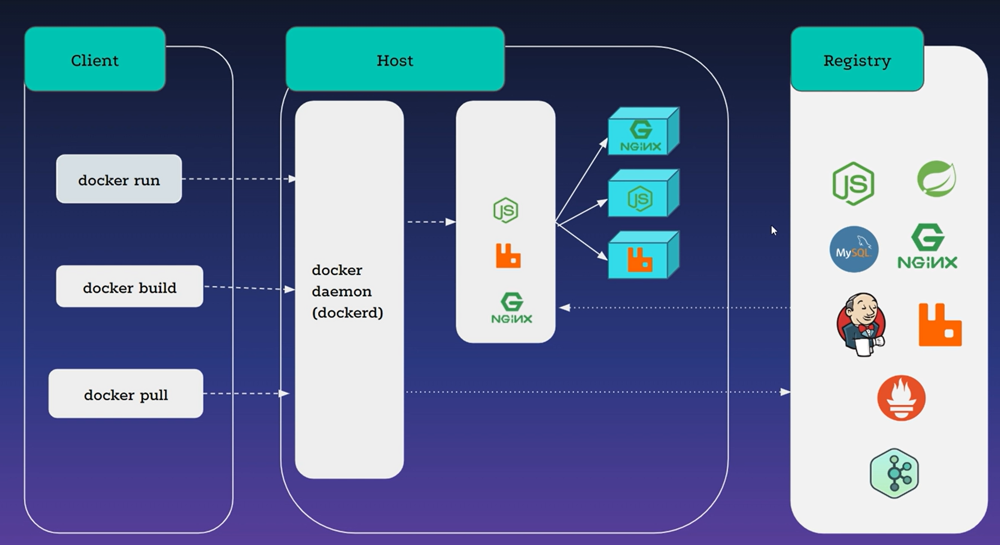

# KIẾN TRÚC DOCKER.

## I. KIẾN TRÚC DOCKER.
Gồm:

- docker client: nhận lệnh từ user(ví dụ: run, pull) gửi vào docker host
- docker host: xử lý câu lệnh, quản lý object(container, volume, images) và kết nối với docker registry để pull, push các imgaes.

- docker registry: dùng để lưu trữ, phân phối iumages. ví vụ: docker hub. ECR của aws...

- docker client và docker host có thể nằm trên cùng 1 máy. nếu không nằm trên cùng 1 máy, client sẽ connect tới dockerd của host
- ta có thể hoàn toàn tạo docker registry private của mình.
## II. THÀNH PHẦN CƠ BẢN.

- container: là 1 môi trường độc lập cho application
- images: file template tạo ra container.

( 1 images buil được nhiều container. 1 container chỉ được buil bằng 1 images)

- volume: 