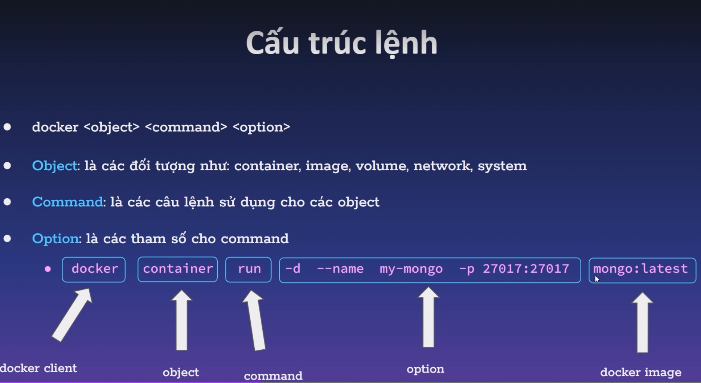
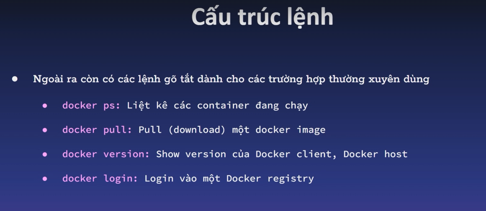
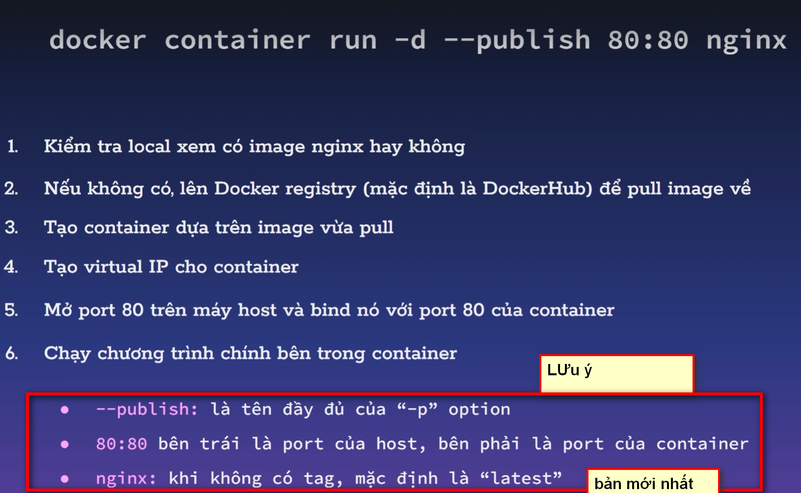

# TỔNG QUAN VỀ DOCKER CONTIANER.

BẢN CHẤT LÀ 1 PROCESS HỆ THỐNG.

LÀ MỘT MÔI TRƯỜNG DỘC LẬP CHO APPLICATION.

## I. CẤU TRÚC LỆNH

### 1.1. CẤU TRÚC LỆNH TIÊU CHUẨN.

`docker +object+command+ [option]`: cấu trúc lệnh tiêu chuẩn

### 1.2. LỆNH TẮT.

### 1.3. LỆNH KIỂM TRA.

`[watch] docker container logs +tênconatiner`: kiểm tra log của chương trình(ví dụ như reload nó cũng báo về nha)

`docker container exec -it +têncontainer+ bash`: truy cập vào bên trong container.
-  tham số -it: với i là để tạo ra sesion và t để tạo ra teminal. 

`docker container stats +têncontainer`: kiểm tra thông số container.

`docker container inspect +têncontainer`: hiển thị chi tiết về container bao gồm địa chỉ ip của conatiner đó.
### 1.4. LỆNH LÀM VIỆC CONTAINER TỪ IMAGES.

### 1.5. LỆNH XÓA CONTAINER.

ĐỂ XÓA CONTAINER, TRƯỚC TIÊN BẠN PHẢI DỪNG NÓ ĐÃ NHA.

`docker system prune -a`: xóa các container đã dừng và không sử dụng

`docker rm $(docker ps -a -f status=exited -q)`: xóa các container đã thoát

`docker stop +container ID`: dừng container

`docker rm <container ID1> [<container ID2>]`: xóa chính xác container

## II. CÁCH HOẠT ĐỘNG.

.

