# BÀI TẬP VỀ CONTAINER.

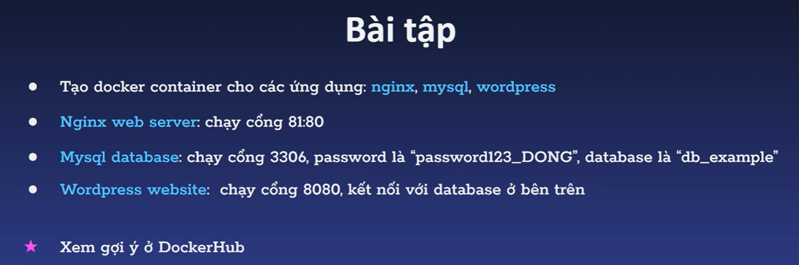.

## I. TẠO CONTAINER NGINX.

### BƯỚC1: TẠO CONTAINER.

`docker pull nginx`: tải images từ dockerhub về. có thể tải or không, khuyến khích tải.

`docker container run --name container-nginx1 -p 80:80 nginx` lệnh chạy container. khi chạy lệnh này, images ngix tải về rồi nó sẽ run luôn. nếu chưa nó cũng tự tải về rồi mới run.
- cái -d để nó luôn chạy ngầm dưới nền nha.

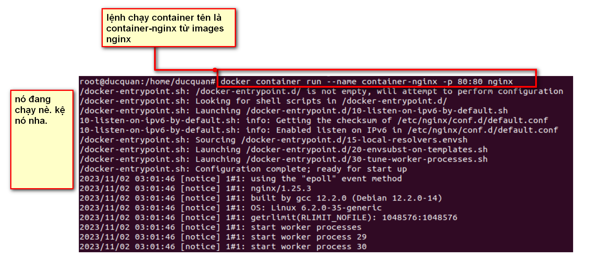

### BƯỚC 2: KIỂM TRA.

truy cập vào trình duyêt: localhost:80
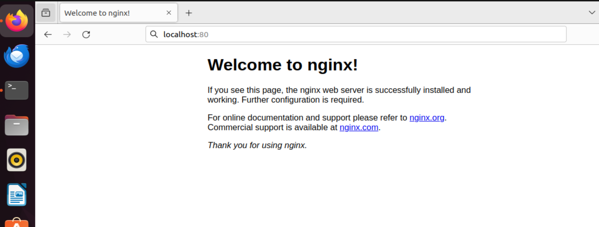

## II. TẠO CONTAINER MYSQL.

### BƯỚC 1: TẠO CONTAINER.

`docker run --name container-mysql2 -p 3307:3306 -e MYSQL_ROOT_PASSWORD=password123_DOING -e MYSQL_DATABASE=db_example -d mysql `: lệnh tạo container có tên container-mysql2 trong đó:

- -e là để đọc biến nha. nó đọc 2 biến mk và tk.
- -d là để nó luôn chạy ngầm dưới nền nha.

LƯU Ý: nếu không may cổng 3306 đã dùng, ta phải check xem nó đang dùng là cái nào

`netstat -plunt`: list ra các port đang dùng
`docker ps`; list ra các container

### BƯỚC 2: TRUY CẬP VÀO CONTAINER.

`docker container exec -it container-mysql2 bash`: lệnh struy cập.

## III. TẠO CONTAINER WORLDPRESS.

TẠO world press dùng database là mysql vừa tạo

### BƯỚC 1: TẠO WORLDPRESS.

`docker run --name container-worldpress -p 8080:80 -d wordpress`: tạo container wordpess.

`localhost:8080`: kiểm tra nhé.

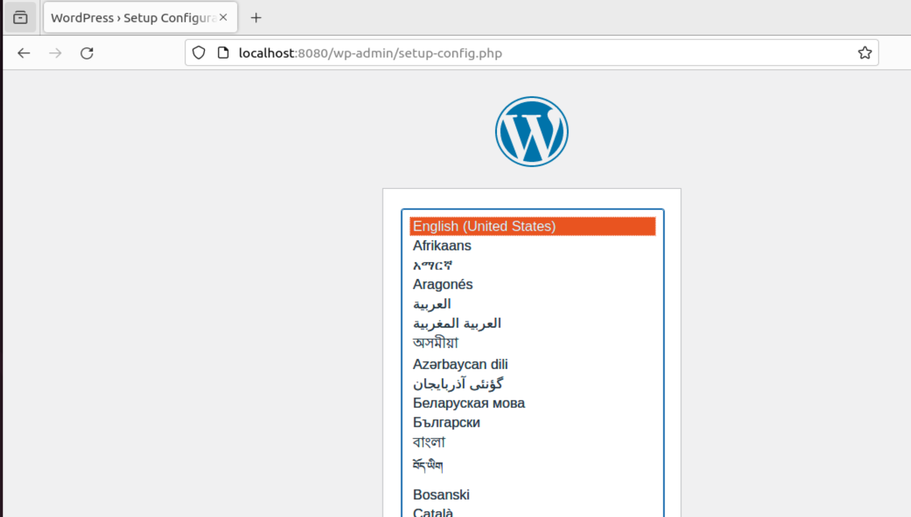

### BƯỚC 2: LẤY ĐỊA CHỈ IP CỦA THẰNG CONTIANER MYSQL

`docker container inspect +têncontainer`: hiển thị chi tiết về container bao gồm địa chỉ ip của conatiner đó.

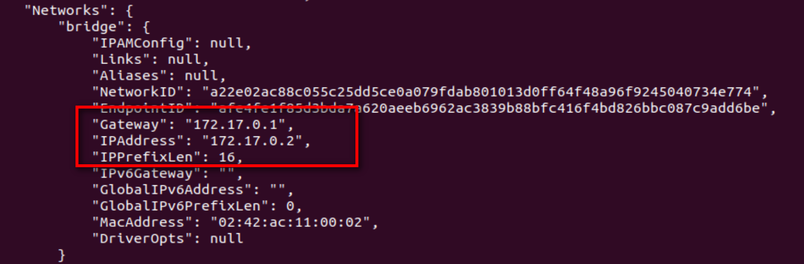

### BƯỚC 3: KẾT NỐI VỚI MYSQL

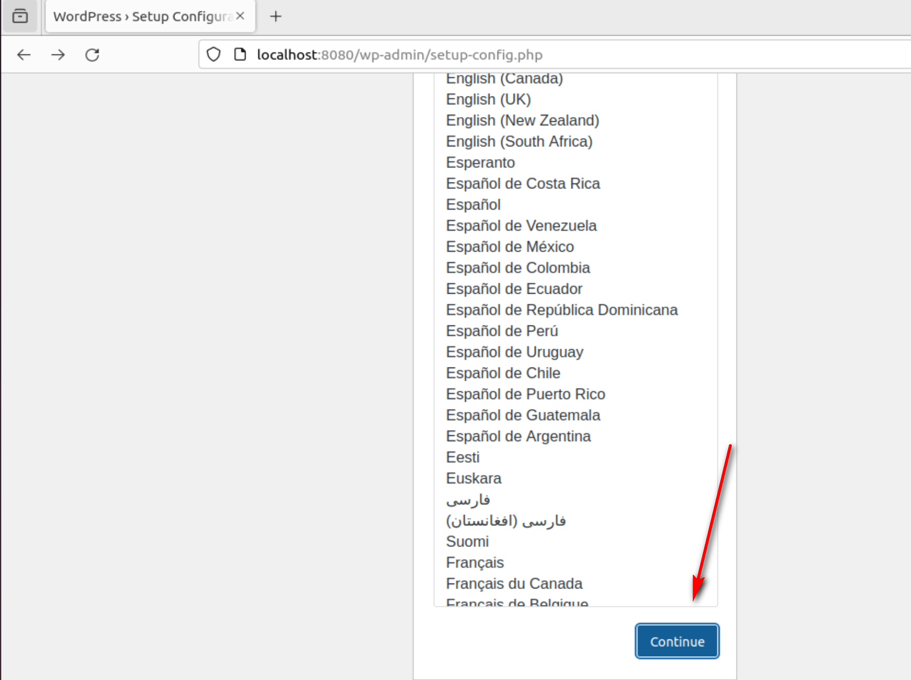

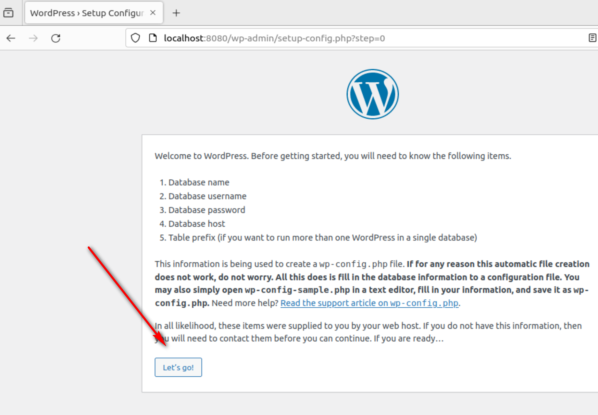

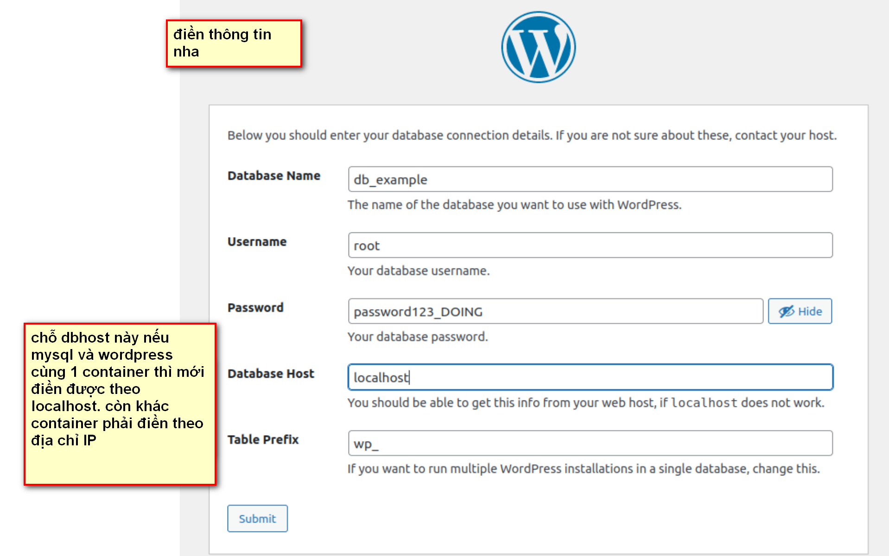

### BƯỚC 4: TẠO BLOG ĐẦU TIÊN.

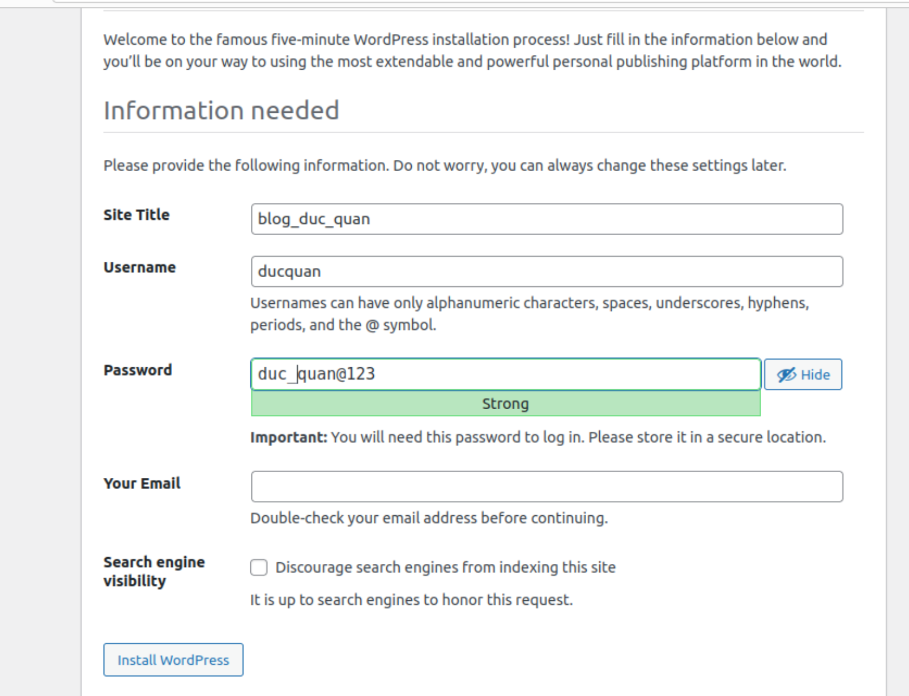
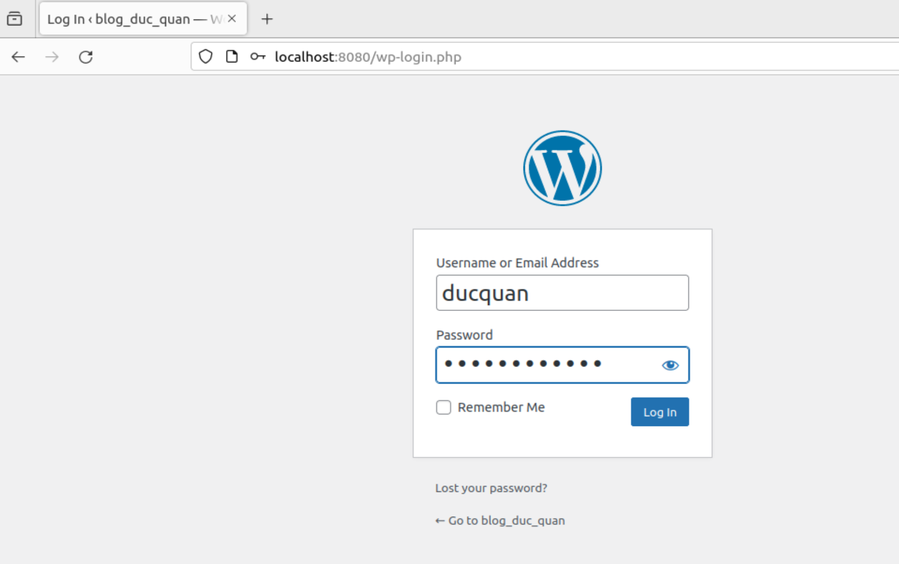
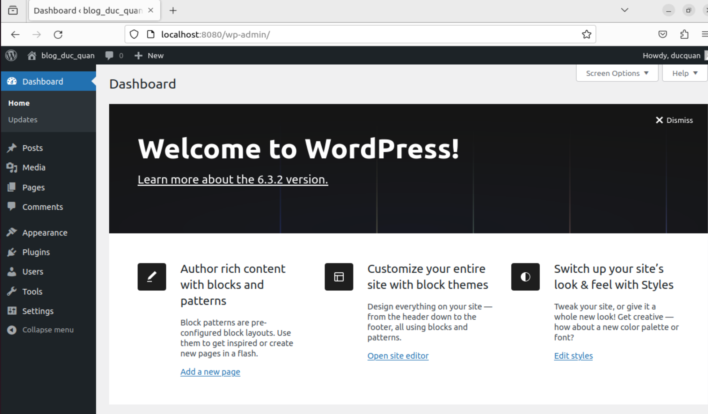

