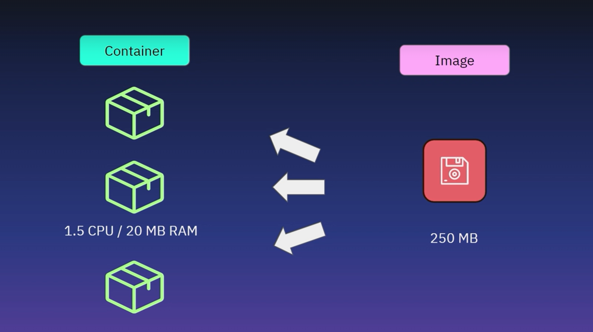
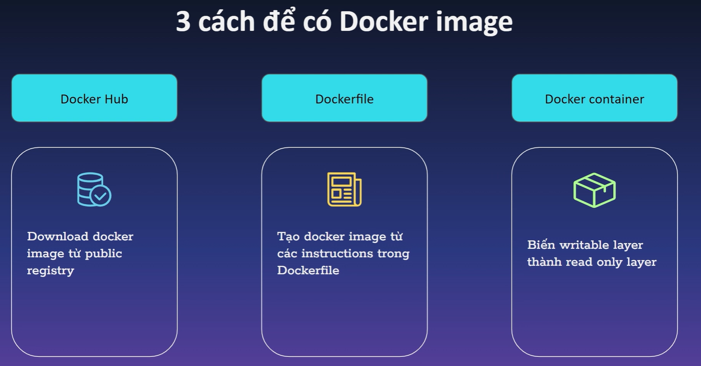
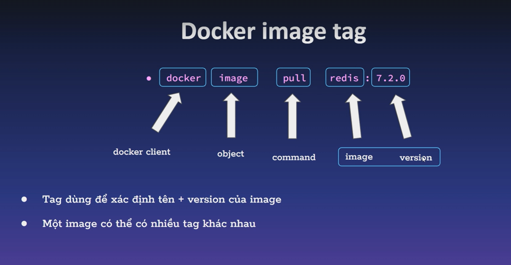
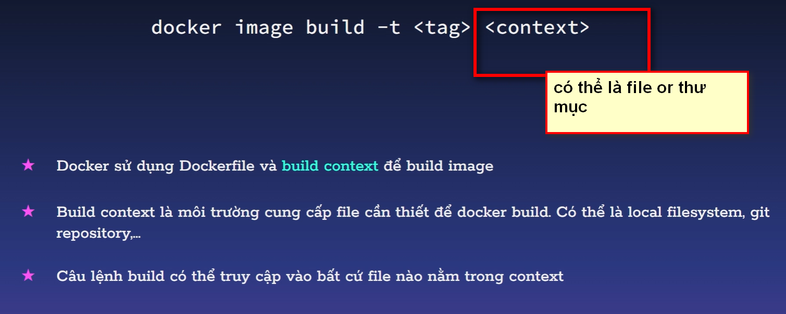
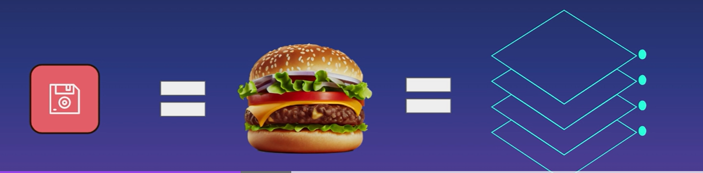
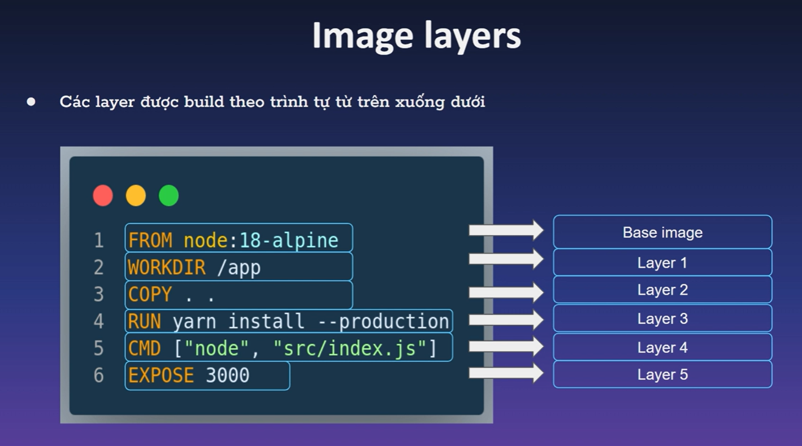
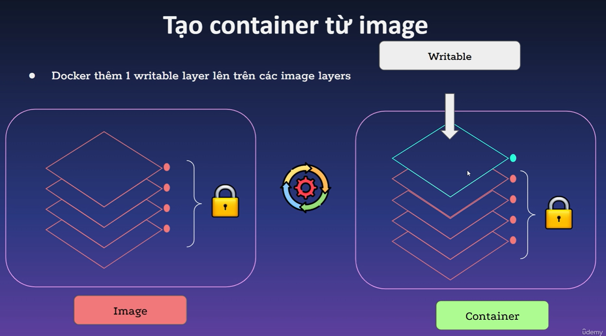
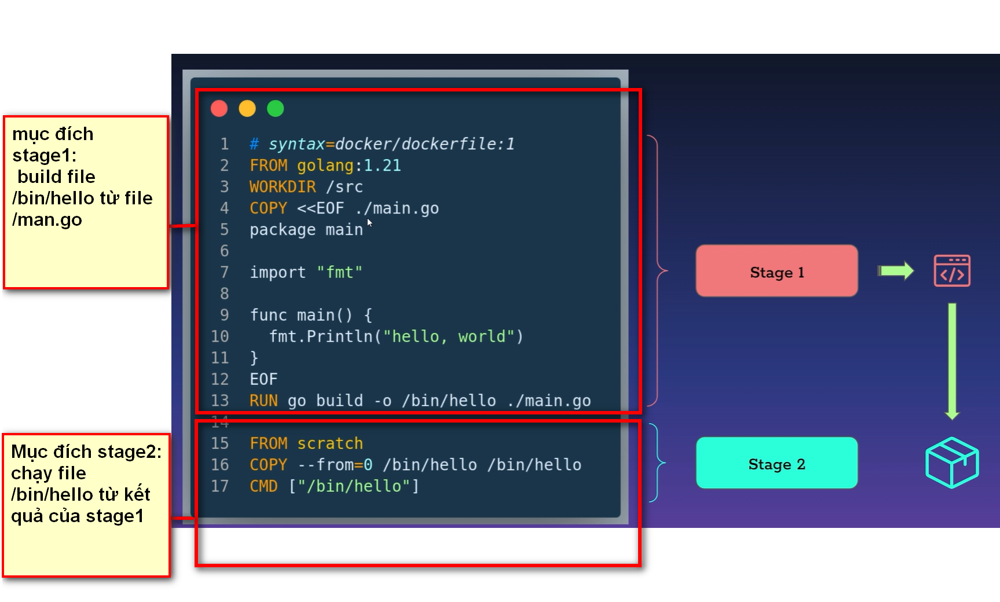

# DOCKER IMAGES.

## MỤC LỤC.

[I. GIỚI THIỆU.]()

[II. LÀM THẾ NÀO ĐỂ CÓ IMAGES.]()

- [2.1.  CÁCH1 1: TẢI IMAGES TỪ DOCKER HUB.]( )

- [2.2. CÁCH 2: DÙNG DOCKER FILE.]()
- [2.3. CÁCH 3: ]()

[III. CẤU TRÚC DOCKER IMGAES.]( )

[IV. TỐI ƯU HÓA QUÁ TRÌNH BUILD.]()

- [4.1. PHƯƠNG PHÁP 1: CACHING LAYER.]()
- [4.2. PHƯƠNG PHÁP 2: DÙNG BASE IMGES.]()
- [4.3. PHƯƠNG PHÁP 3: SỬ DỤNG BUILD NHIỀU GIAI ĐOẠN(MUILTY STATE BUILD).]( )

## I. GIỚI THIỆU.

- là file app binary + các dependencies( các trương trình con, thư viện...)

## II. LÀM THẾ NÀO ĐỂ CÓ IMAGES.

- tải trực tiếp images từ docker hub.

- Dùng docker file.

- Tạo từ docker container

### 2.1. TẢI IMAGES TỪ DOCKER HUB.

`docker images pull +tênimages`: lệnh tải images về.

### 2.1.1. DOCKER_IMAGES_TAG

Là tên images+version.

### 2.2. DÙNG DOCKER FILE.

Là file chứa các chỉ dẫn cho dockerd.

VÍ DỤ.

### 2.2.2. BUILD CONTEXT.

### 2.3. TẠO DOCKER IMAGES TỪ CONTAINER.

`docker container commit +têncontainer +tênimages`: tạo images từ container

## III. CẤU TRÚC DOCKER IMGAES.

Images được tạo bởi 1 chuỗi layer (các layer chỉ read-only)

Mỗi layer chính là 1 sự thay đổi trên filesystem.

các layer xếp chồng lên nhau từ dưới lên trên. bên trên sẽ kế thừa bên dưới. chính vì sự đặc biệt này, có 1 kỹ thuật là kỹ thuật caching layer để tối ưu hóa docker file

VÍ DỤ;

KHI TẠO CONTAINER TỪ IMAGES, CONTAINER SẼ THÊM 1 LAYER NỮA LÊN TRÊN CỦA CÁC LAYER CŨ CỦA IMAGES. ĐIỀU KHÁC BIỆT LÀ LAYER NÓ CÓ QUYỀN GHI.

## IV. TỐI ƯU HÓA QUÁ TRÌNH BUILD.

### 4.1. CACHING LAYER.

là kỹ thuật dùng để tối ưu hóa docker file dựa vào thuộc tính kế thừa layer

### 4.2. BASE IMGES.

### 4.2. SỬ DỤNG BUILD NHIỀU GIAI ĐOẠN(MUILTI STAGE BUILD).

TA ĐẶT TÊN CÁC GIAI ĐOẠN Ở CHỖ FROM NHA.

`FROM +imagescơsở + as +tên stage`: lệnh đặt tên giai đoạn.

Khi build dockerfile. chúng ta sẽ gặp phải vấn đề ví dụ như sau:

- ta cần file /bin/ hello để buil dockerfile. nhưng cài đặt file đó rất nhiều thư viện

- vậy ta sẽ tạo riêng 1 stage để build ra file /bin/hello thôi.

- ta sẽ tạo 1 stage khác lấy kết quả của stage 1 để build. nó sẽ nhẹ hơn khi ta build docker file đó.

