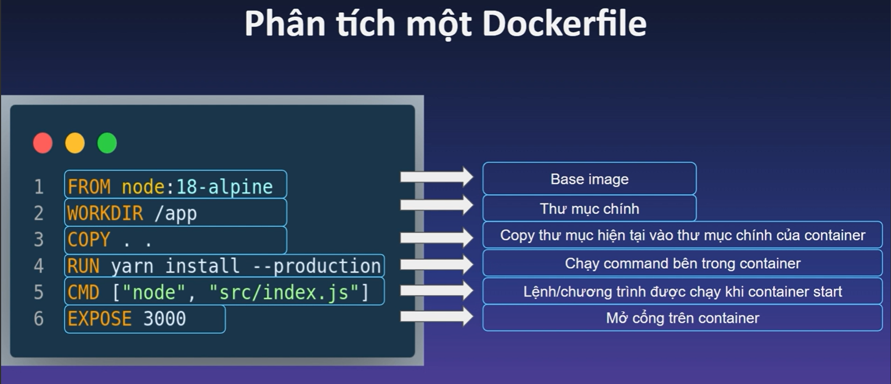

# DOCKER IMAGES.

## I. GIỚI THIỆU.

- là file app binary + các dependencies( các trương trình con, thư viện...)

## II. LÀM THẾ NÀO ĐỂ CÓ IMAGES.

- tải trực tiếp images từ docker hub.

- Dùng docker file.

### 2.1. TẢI IMAGES TỪ DOCKER HUB.

`docker images pull +tênimages`: lệnh tải images về.

### 2.1.1. DOCKER_IMAGES_TAG

Là tên images+version.

### 2.2. DÙNG DOCKER FILE.

Là file chứa các chỉ dẫn cho dockerd.

VÍ DỤ.

### 2.2.2. BUILD CONTEXT.

## III. CẤU TRÚC DOCKER IMGAES.

Images được tạo bởi 1 chuỗi layer (các layer chỉ read-only)

Mỗi layer chính là 1 sự thay đổi trên filesystem.

các layer xếp chồng lên nhau từ dưới lên trên. bên trên sẽ kế thừa bên dưới. chính vì sự đặc biệt này, có 1 kỹ thuật là kỹ thuật caching layer để tối ưu hóa docker file

VÍ DỤ;

### 3.1. CACHING LAYER.

là kỹ thuật dùng để tối ưu hóa docker file.

### 3.2. BASE IMGES.

