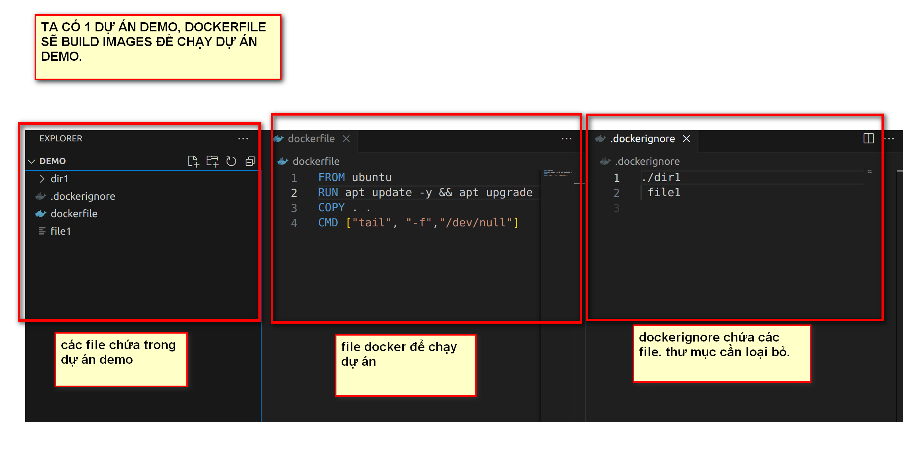
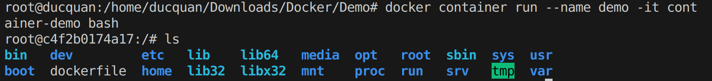
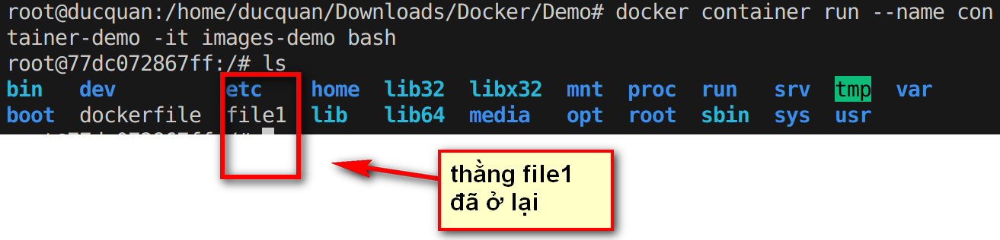

# LOẠI TRỪ CÁC FILE KHÔNG SỬ DỤNG TRONG QUÁ TRÌNH BUILD.

- TRONG QUÁ TRÌNH BUILD, 1 SỐ FILE, THƯ MỤC KHÔNG NHẤT THIẾT PHẢI Ở TRONG QUÁ TRÌNH NÀY, TA CÓ THỂ LOẠI BỎ CÁC FILE, THƯ MỤC ĐÓ BẰNG DOCKERIGNOR.

-  ĐỂ LOẠI BỎ, TA CHỈ CẦN VIẾT TÊN FILE, THƯ MỤC VÀO DOCKER IGNORE THÔI. NÓ TỰ ĐỌC NHA.

**VÍ DỤ**: TA SẼ THỰC HIỆN 1 LOẠT NHỮNG HÀNH ĐỘNG SAU ĐỂ THẤY RÕ CÁCH HOẠT ĐỘNG CỦA DOCKER IGNORE.

### TRƯỜNG HỢP 1:  khi ta build images từ docker file, nó sẽ bỏ qua file demo và thư mục

- bước 1: xóa bỏ file1 trong file dockerignore

- bước 2: build lại images: `docker build -t images-demo -f dockerfile .`

- bước 3: chạy lại container: `docker container run --name demo -it images-demo bash`

- bước 3: list lại xem thư mục: `ls

.

### TRƯỜNG HỢP 2: khi ta bỏ các thư mục khỏi file dockerignore thì sao?

ta chỉ cần xóa tên file, thư mục trong dockerignore đi là song nha. ví dụ ta để lại file1

- bước 1: xóa bỏ file1 trong file dockerignore

- bước 2: build lại images: `docker build -t images-demo -f dockerfile .`

- bước 3: chạy lại container: `docker container run --name demo -it images-demo bash`

- bước 3: list lại xem thư mục: `ls

