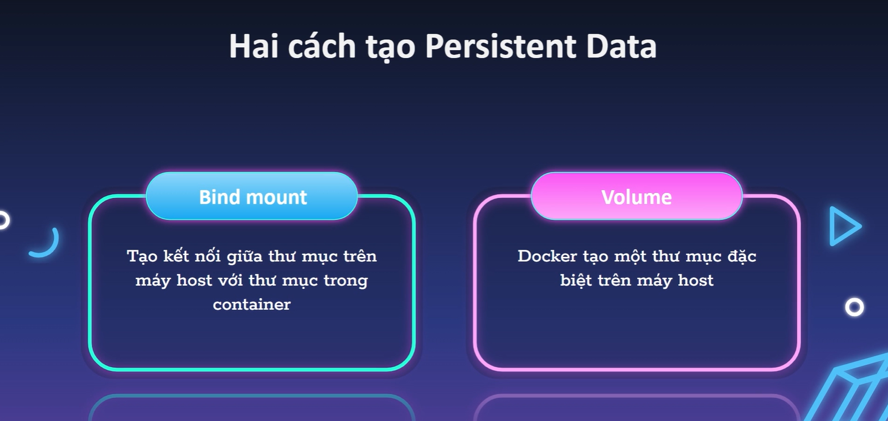
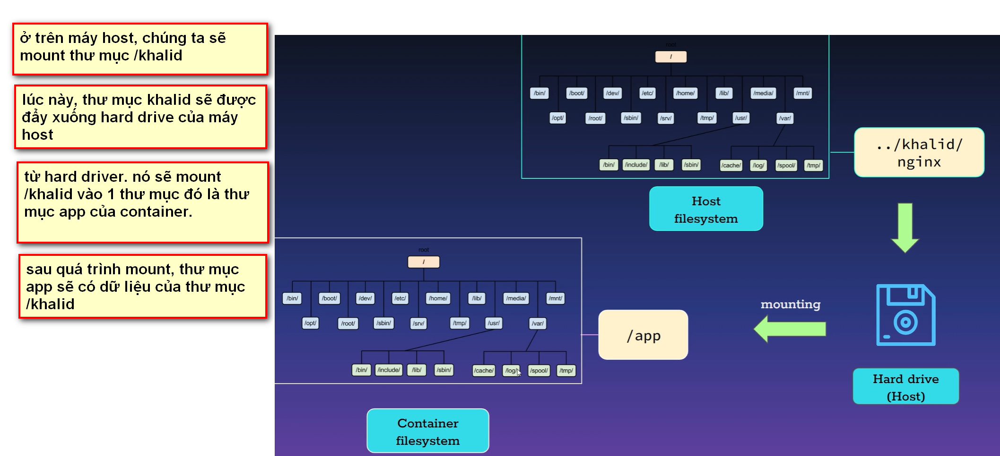
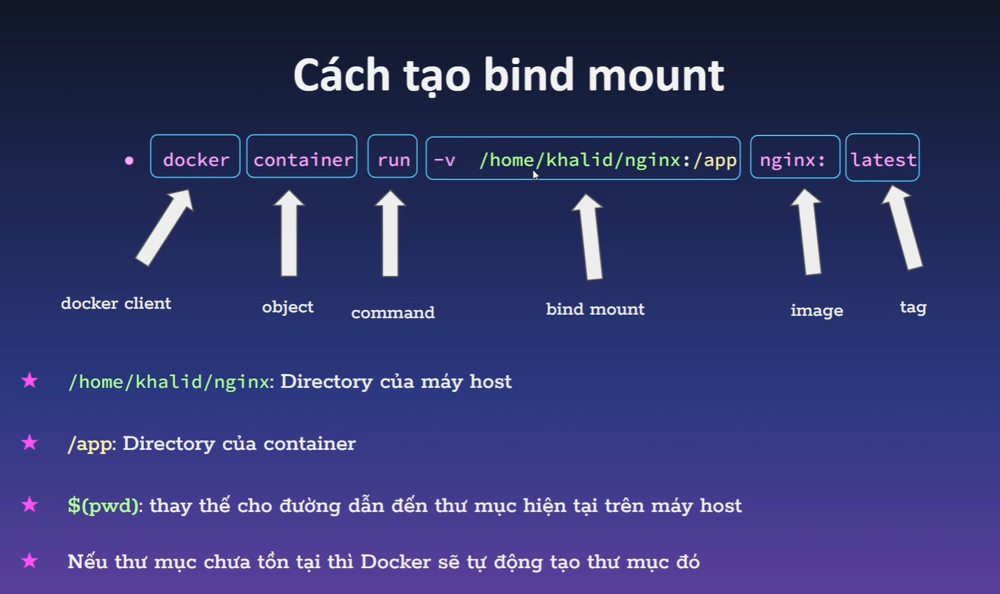
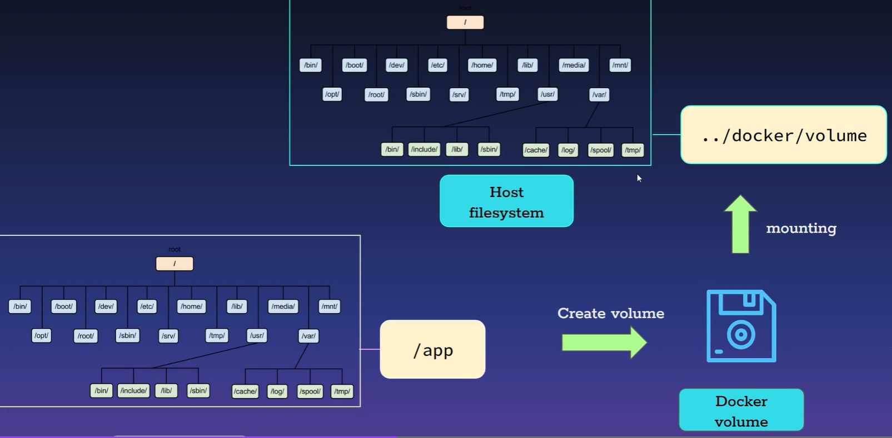
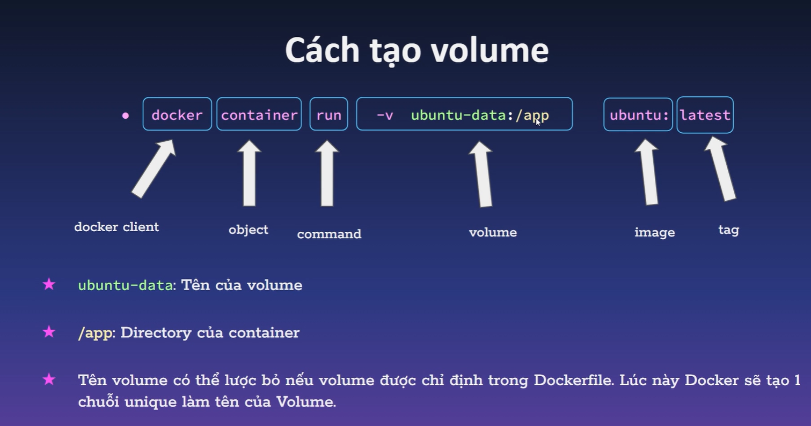

# PERSISTENT DATA.

## I. PERSISTENT DATA LÀ GÌ?

Khi tạo, thay thế container hay contianer bị đột tử thì dữ liệu sẽ bị mất.

=> cần tạo ra 1 không gian tách biệt với container để lưu trữ data ra khỏi container.

CÁCH TẠO PERSISTIENT DATA: 

- DÙNG BINDMOUNT.
- DÙNG VOLUME.

## II. BIND MOUND.

### 2.1. KHÁI NIỆM.

Là tạo ra kết nối giữa thư mục trong container và thư mục trên host

Là kỹ thuật dựa trên kỹ thuật mounting: khi gắn 1 máy A vào filesystem của máy B thì máy B có thể nhìn thấy data của máy A.

Là tạo ra kết nối giữa thư mục trong container và thư mục trên host

VÍ DỤ:

### 2.2. CÁCH TẠO BIND MOUNT.

` docker container run -v +thưmụctrênmáyhost:thưmụctrêncontainer +images`: mounte data từ thư mục trên máy host vào thư mnục trên conatiner. 

`docker container --name +têncontainer -`

.

## III. VOLUME.

### 3.1. KHÁI NIỆM

Mục đích thì giônngs với bindmoubt. tuy nhiên, docker hoàn toàn quản lý volume(khác với bindmount thì dữ liệu nằm trên máy host và do mình quản lý)

Cách làm: mount ngược lại thư mục từ container về máy host.

### 3.2. CÁCH TẠO VOLUME.

LƯU Ý: VOLUME LÀ NƠI LƯU TRỮ DỮ LIỆU, TA KHÔNG THỂ XEM NÓ TỪ MÁY CỦA TA. TA CHỈ CÓ THỂ GẮN NÓ VÀO 1 CONTAINER RỒI TRUY CẬP VÔ TRONG CONTAINER ĐÓ MỚI DÙNG ĐƯỢC. MỤC ĐÍCH CHỈ ĐỂ BK.

`docker volume create tênvolume `: tạo 1 volume

`docker container run -v +TÊNCỦAVOLUME: thưmụctrêncontaienercần mounte + images`: tạo volume rồi gắn vô container mới.

`docker container update --mount source=my_volume,target=/path/in/container my_container`: gắn volume vào 1 container đang chạy.

### 3.3. CÁCH ĐƯA DỮ LIỆU TỪ CONTAINER VỀ MÁY HOST ĐỂ SỬ DỤNG ĐƯỢC NHA.

`docker cp container_id:/path/in/container /path/on/host`

