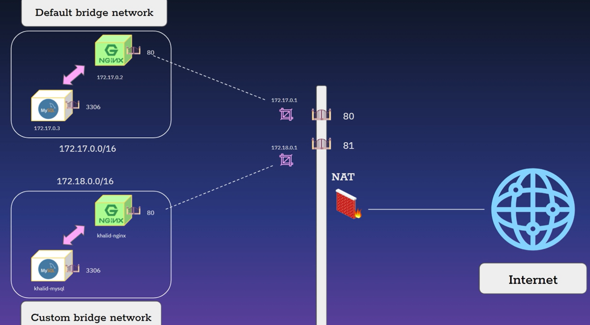

# 

## VÍ DỤ 1:  TẠO 1 MẠNG.

TA CẦN TẠO 2 MẠNG DEFAULT VÀ CUSTOM NHƯ HÌNH. SAU ĐÓ NHANH CHÓNG CHO NÓ PING QUAN LẠI THÔI.

###  BƯỚC 1: TẠO 1 MẠNG DEFAULT.
 giả sử ta có images r nha.

 `docker container run --name container-default -d --network defauls nginx`: câu lệnh tạo 1 con tainer trong 1 network có tên default

 ### BƯỚC 2: TẠO CONTAINER TRONG NETWORK CUSTOM

`docker network create custom`: tạo 1 mạng có tên custom

`docker container run --name container-custom -d --network custom nginx`: tạo container trong network custom.

## KẾT NỐI 1 CONTAINER TỚI 2 MẠNG.

