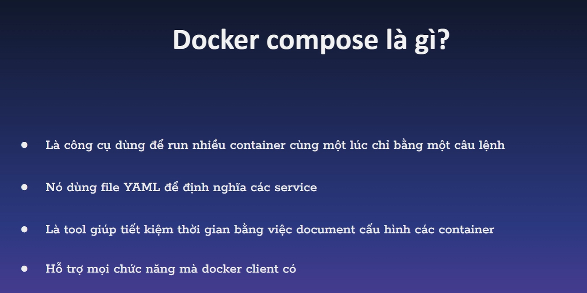
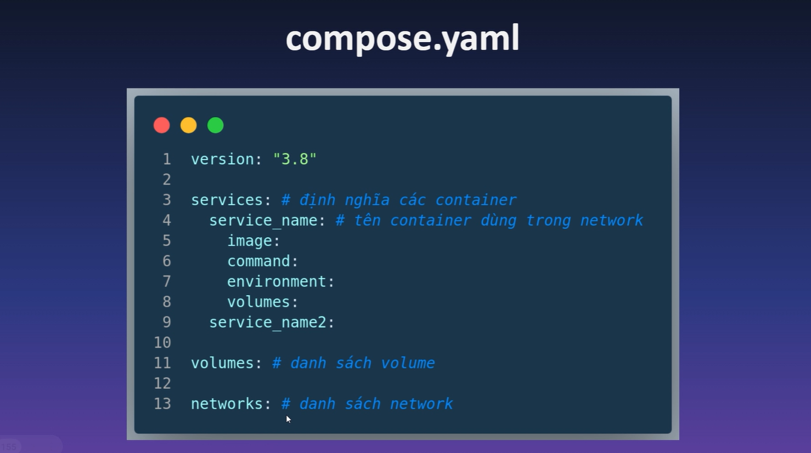
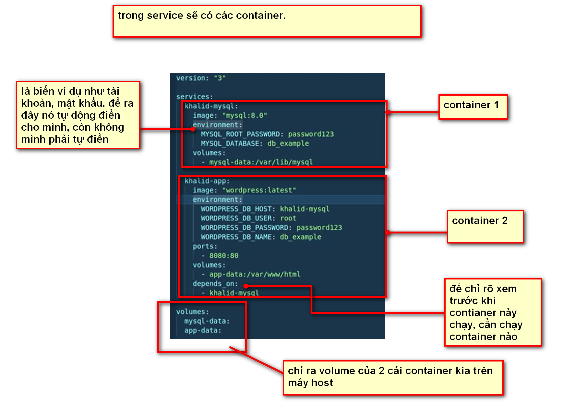

# GIỚI THIỆU

ĐỂ RUN NHIỀU CONTAINER CÙNG 1 LÚC.

## I. DOCKER COMPOSE LÀ GÌ?





file yaml sẽ chứa các service (contianer). Trong các service sẽ là các application.
### 1.1. VÍ DỤ.



## II. LỆNH.

### 2.1. LỆNH TẠO.

`docker compose build `: chỉ xây dựng images chứ không chạy( nói đúng hơn k tạo volume)

 `docker compose up -d`: lệnh chạy docker.

 `docker compsse -f +tên file yaml+ up -d`: dùng để chạy file yaml và chỉ rõ muốn chạy file nào.


 ### 2.2. LỆNH XÓA.

 `docker compose down`: xóa container nhưng vẫn giữ volume trên máy host.

`docker compose down -v`: xóa container và xóa luôn volume.

`docker-compose stop`: dừng lại việc chạy container.


### 2.3. LỆNH KIỂM TRA.


`docker-compose ps`: kiểm tra trạng thái của các container

`docker-compose logs`: hiển thị log của các container


## III. TỐI ƯU HÓA FILE YAML.

### 3.1. TỐI ƯU HÓA BIẾN ENV.

nếu biến phần environment quá nhiều, ta hoàn toàn có thể tạo 1 file lưu trữ các biến này.

lúc này câu lệnh thành phần tạo biến sẽ là: 

```
env_file:
      
      - .env

```


